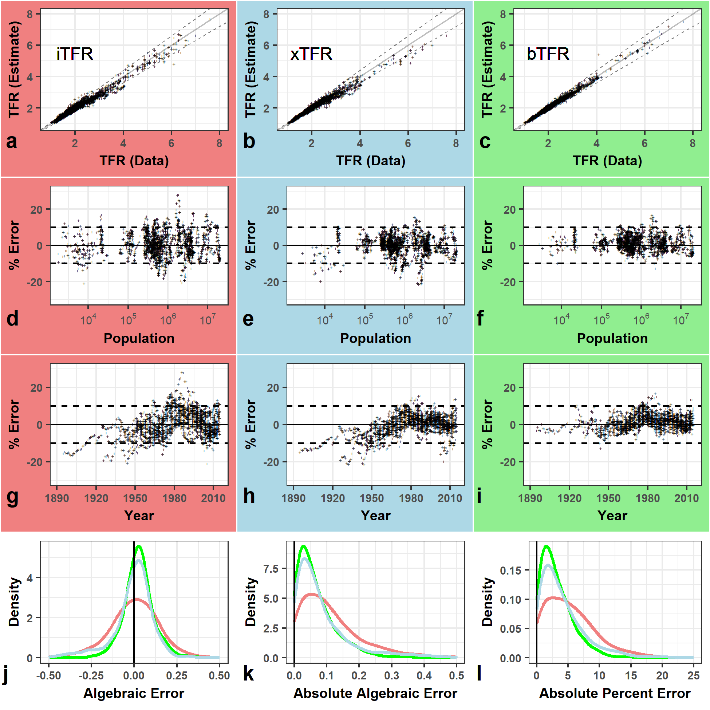

# Population pyramids yield accurate estimates of total fertility rates

# Introduction
Here we provide the data and code for:  [**Population pyramids yield accurate estimates of total fertility rates**](https://github.com/mathewhauer/iTFR-replication/blob/master/MANUSCRIPT/manuscript.pdf)

### Citation

> Hauer, M.E. & Schmertmann, C. *Demography.* (DOI Forthcoming) (YEAR ACCESSED).

# Abstract
> The primary fertility index for a population, the total fertility rate (TFR), cannot be calculated for many areas and time periods because it requires disaggregation of births by mother’s age. Here we discuss a flexible framework for estimating TFR using inputs as minimal as a population pyramid. We develop five variants, each with increasing complexity and data requirements. To evaluate accuracy we test using more than 2,400 fertility schedules with known TFR values, across a diverse set of data sources --  including the Human Fertility Database, Demographic and Health Surveys, U.S. counties, and nonhuman species. We show that even the simplest and least accurate variant has a median error of only 0.09 births/woman over 2,400 fertility schedules, suggesting accurate TFR estimation over a wide range of demographic conditions. We anticipate that this framework will extend fertility analysis to new subpopulations, time periods, geographies, and even species. To demonstrate the framework's utility in new applications, we produce subnational estimates of African fertility levels, reconstruct historical European TFRs for periods up to 150 years before the collection of detailed birth records, and estimate TFR for the U.S. conditional on race and household income.

**Estimated TFR from Population Pyramids.** We compare the performance of five variants against observed TFRs using data from the Human Fertility Data, Demographic and Health Surveys, the US Census Bureau, and various non-human species.

To see all of the underlying code and the results, [click here](http://htmlpreview.github.io/?https://github.com/mathewhauer/iTFR-replication/blob/master/MANUSCRIPT/reproduce.html)

# Organization
- `/R/SCRIPTS/`  — Scripts and output for figures included in the main document.
- `/R/DATA-RAW/`  — Initial data resources, unprocessed.
- `/R/DATA-PROCESSED/` — Post-processed data for our analysis.
- `/MANUSCRIPT/manuscript.Rmd` — contains a replication of the manuscript file

- `/MANUSCRIPT/reproduce.Rmd` — contains a replication for underlying estimates.
- `/R/BayesAnalysis_sample.R` — a sample R script to produce all five variants, including the Bayesian estimates of TFR. (requires Stan)
- `/R/superfast_bTFRfunction.R` — a sample R script to produce just Bayesian estimates of TFR. Does not require Stan, but use at your own risk.

# Use
- Feel free to create a new branch for further incorporation and analysis. 

# Correspondence
For any issues with the functionality of these scripts please [create an issue](https://github.com/mathewhauer/iTFR/issues).

## License
The data collected and presented is licensed under the [Creative Commons Attribution 3.0 license](http://creativecommons.org/licenses/by/3.0/us/deed.en_US), and the underlying code used to format, analyze and display that content is licensed under the [MIT license](http://opensource.org/licenses/mit-license.php).